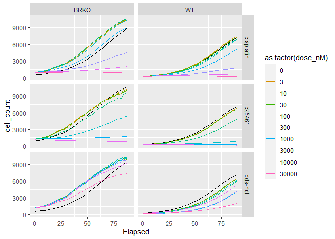
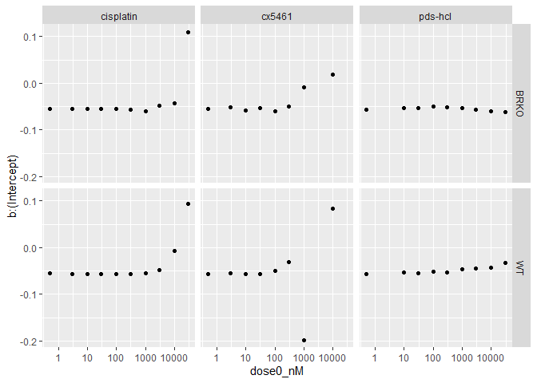
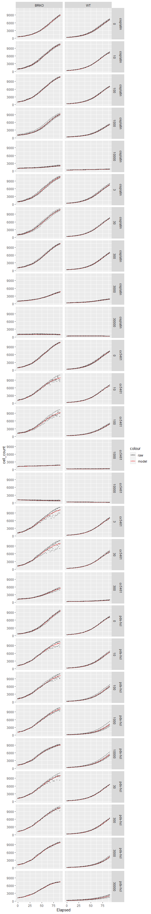

# Initialize

load packages

    library(tidyverse)
    library(here)
    library(drc)

    # custom ggpplot colors 
    gg_color_hue <- function(n) {
      hues = seq(15, 375, length = n + 1)
      hcl(h = hues, l = 65, c = 100)[1:n]
    }

    #replace first color with black (for dose = 0)
    gg_pal = gg_color_hue(10)
    gg_pal[1] <- "#000000"

import data

    # number of treatment plates and lines in experiment
    n_plates <- 2
    n_lines <- 2

    # order of cell lines in raw
    order <- c("WT", "BRKO")

    # initialize raw and metadata, as list
    raw <- vector(mode = "list", length = n_lines*n_plates)
    metadata <- vector(mode = "list", length = n_plates)

    # meta data for plates 
    metadata[[1]] <- read_csv(here("20220504_DLD1_metadata_1.csv"))
    metadata[[2]] <- read_csv(here("20220504_DLD1_metadata_2.csv"))

    raw[[1]] <- read_csv(here("20220504_DLD1_NuclightRED_WT_cx5461_pds-hcl.csv")) %>%
      pivot_longer(cols = -(1:2), names_to = "well", values_to = "cell_count") %>%
      left_join(metadata[[1]], by="well") %>% 
      mutate(cell_line = order[1])

    raw[[2]] <- read_csv(here("20220504_DLD1_NuclightRED_WT_cisplatin.csv")) %>%
      pivot_longer(cols = -(1:2), names_to = "well", values_to = "cell_count") %>%
      left_join(metadata[[2]], by="well") %>% 
      mutate(cell_line = order[1])

    raw[[3]] <- read_csv(here("20220504_DLD1_NuclightRED_BracKO_cx5461_pds-hcl.csv")) %>%
      pivot_longer(cols = -(1:2), names_to = "well", values_to = "cell_count") %>%
      left_join(metadata[[1]], by="well") %>% 
      mutate(cell_line = order[2])

    raw[[4]] <- read_csv(here("20220504_DLD1_NuclightRED_BracKO_cisplatin.csv")) %>%
      pivot_longer(cols = -(1:2), names_to = "well", values_to = "cell_count") %>%
      left_join(metadata[[2]], by="well") %>% 
      mutate(cell_line = order[2])

    raw <- bind_rows(raw)

    raw$compound <- replace(raw$compound, raw$compound == "pbs", "pds-hcl")
    raw$compound <- replace(raw$compound, raw$compound == "nahpo4", "cx5461")
    raw$compound <- replace(raw$compound, raw$compound == "dmso", "cisplatin")

    raw_summary <- raw %>% dplyr::group_by(`Date Time`, Elapsed, compound, dose_nM, cmpd_cat, cell_line) %>%
      summarize(cell_count = mean(cell_count))

# Plot

## growth curves

facet by genotype and drug

    ggplot(raw_summary, aes(x = Elapsed, y = cell_count, color = as.factor(dose_nM))) + 
      geom_line() +
      facet_grid(rows = vars(compound), cols = vars(cell_line)) +
      scale_color_manual(values=gg_pal)

## logistic modelling

    raw_temp <- raw %>% mutate(unique = paste(compound,dose_nM,cell_line, sep = ";"))

    temp <- map(unique(raw_temp$unique), function (x) drm(subset = unique %in% x, formula = cell_count ~ Elapsed, curveid  = unique, data = raw_temp, fct = L.4(), type = "continuous"))

    # prediction data
    elapsed_time <- expand.grid(Elapsed=seq(0,90, length=180))

    # predictions and confidence intervals
    pm <- map(temp, function(x) predict(x, newdata=elapsed_time))

    ## Warning in sqrt(diag(varMat)): NaNs produced

    ## Warning in sqrt(diag(varMat)): NaNs produced

    ## Warning in sqrt(diag(varMat)): NaNs produced

    ## Warning in sqrt(diag(varMat)): NaNs produced

    # new data with predictions
    newdata <- map(pm, function(x) elapsed_time %>% mutate(cell_count = x))

    newdata <- bind_rows(newdata)
    newdata$unique <- rep(unique(raw_temp$unique), each=180)

    newdata <- newdata %>% separate(unique, into = c("compound", "dose_nM", "cell_line"), sep = ";")

    hill_slope <- map(temp, function(x) x$coefficients[1])
    hill_slope <- bind_rows(hill_slope)
    hill_slope$unique <- unique(raw_temp$unique)
    hill_slope <- hill_slope %>% separate(unique, into = c("compound", "dose_nM", "cell_line"), sep = ";") %>%
      mutate(dose_nM = as.numeric(dose_nM))

    hill_slope$dose0_nM <- hill_slope$dose_nM
    hill_slope$dose0_nM[hill_slope$dose0_nM == 0] <- 0.5

plot slope by concentration for drm modelling

    hill_slope %>% ggplot(aes(x = dose0_nM, y = `b:(Intercept)`)) +
      geom_point() +
      scale_x_log10() +
      facet_grid(rows = vars(cell_line), cols = vars(compound))

    # plotting the curve
    ggplot(data = newdata, aes(x = Elapsed, y = cell_count)) + 
      geom_line(aes(color = "red")) +
      geom_line(data = raw_summary, alpha = 0.1, aes(color = "black")) +
      scale_color_manual(labels = c("raw", "model"), values = c("black", "red")) +
      facet_grid(rows = vars(compound,as.factor(dose_nM)), cols = vars(cell_line))

# from DLD1\_NuclightRED\_20220504\_curvefit\_slope.R

    # Import libraries --------------------------------------------------------

    library(ggplot2)
    library(plotly)
    library(patchwork)
    library(drc)
    library(tidyr)
    library(dplyr)

    # Import dataset ----------------------------------------------------------

    wt1 <- read.csv('./20220504_DLD1_NuclightRED_WT_cx5461_pds-hcl.csv')
    wt2 <- read.csv('./20220504_DLD1_NuclightRED_WT_cisplatin.csv')
    mut1 <- read.csv('./20220504_DLD1_NuclightRED_BracKO_cx5461_pds-hcl.csv')
    mut2 <- read.csv('./20220504_DLD1_NuclightRED_BracKO_cisplatin.csv')
    metadata1 <- read.csv('./20220504_DLD1_metadata_1.csv')
    metadata2 <- read.csv('./20220504_DLD1_metadata_2.csv')

    # Process data to long form -----------------------------------------------

    ##wt and mut not found, need to specify object in the ncol in pivot_longer argument
    ##Specify wt1, wt2, mut1, mut2
    ##Ex: changed the wt_long transform in the pivot_longer(cols = 3:ncol(wt1)...)
    wt_long1 <- wt1 %>%
      pivot_longer(cols = 3:ncol(wt1), names_to = "well", values_to = "cell_count") %>%
      left_join(metadata1, by="well") %>% 
      mutate(cell_line = "WT")

    wt_long2 <- wt2 %>%
      pivot_longer(cols = 3:ncol(wt2), names_to = "well", values_to = "cell_count") %>%
      left_join(metadata2, by="well") %>% 
      mutate(cell_line = "WT")

    mut_long1 <- mut1 %>% 
      pivot_longer(cols = 3:ncol(mut1), names_to = "well", values_to = "cell_count") %>%
      left_join(metadata1, by = 'well') %>%
      mutate(cell_line = "BRKO")

    mut_long2 <- mut2 %>% 
      pivot_longer(cols = 3:ncol(mut1), names_to = "well", values_to = "cell_count") %>%
      left_join(metadata2, by = 'well') %>%
      mutate(cell_line = "BRKO")

    ## These replacements will only happen on the first assignment 
    ## (All DMSO will be assigned MMAE and not SN38) since the DMSO is not unique
    #merged <- rbind(wt_long1, wt_long2, mut_long1, mut_long2) %>%
    #  mutate(compound2 = compound) %>%
    #  mutate(compound2 = replace(compound2, compound2 %in% "Vehicle", "CX5461")) %>%
    #  mutate(compound2 = replace(compound2, compound2 %in% "Vehicle", "MMAE")) %>%
    #  mutate(compound2 = replace(compound2, compound2 %in% "Vehicle", "SN38")) %>%
    #  mutate(compound2 = replace(compound2, compound2 %in% "Vehicle", "Cetuximab")) %>%
    #  mutate(compound2 = replace(compound2, compound2 %in% "Vehicle", "Cet-CX5461")) %>%
    #  mutate(compound2 = replace(compound2, compound2 %in% "Vehicle", "Cet-MMAE")) %>%
    #  mutate(compound2 = replace(compound2, compound2 %in% "Vehicle", "Cet-SN38")) %>%
    #  mutate(cmpd_dose = paste(compound2, dose_nM, sep = "."))

    ## Leaving the groups as is 
    merged <- rbind(wt_long1, wt_long2, mut_long1, mut_long2) %>%
      mutate(compound2 = compound) %>%
      mutate(cmpd_dose = paste(compound2, dose_nM, sep = "."))

    # Explore datasets --------------------------------------------------------

    #WT line dose response
    p1 <- ggplot(wt_long1, aes(x=Elapsed, y = cell_count)) +
      geom_smooth(aes(colour = as.factor(dose_nM)), se=FALSE) +
      scale_color_viridis_d(option="A") +
      facet_wrap(~compound) +
      ggtitle("DLD1 NuclightRED WT")

    p2 <- ggplot(wt_long2, aes(x=Elapsed, y = cell_count)) +
      geom_smooth(aes(colour = as.factor(dose_nM)), se=FALSE) +
      scale_color_viridis_d(option="A") +
      facet_wrap(~compound) +
      ggtitle("DLD1 NuclightRED WT")

    #Mutant line response
    p3 <- ggplot(mut_long1, aes(x=Elapsed, y = cell_count)) +
      geom_smooth(aes(colour = as.factor(dose_nM)), se=FALSE) +
      scale_color_viridis_d(option="A") +
      facet_wrap(~compound) +
      ggtitle("DLD1 NuclightRED BRCA2-/-")

    p4 <- ggplot(mut_long2, aes(x=Elapsed, y = cell_count)) +
      geom_smooth(aes(colour = as.factor(dose_nM)), se=FALSE) +
      scale_color_viridis_d(option="A") +
      facet_wrap(~compound) +
      ggtitle("DLD1 NuclightRED BRCA2-/-")

    #plot 1 
    p1+p2+p3+p4

    #Compare average effects between cell lines
    ggplot(merged, aes(x=Elapsed, y = cell_count)) +
      geom_smooth(aes(colour = cell_line), se=FALSE) +
      scale_color_brewer(palette = "Set1") +
      facet_wrap(~compound) +
      ggtitle("Average effect per cell line")

    #Compare dose response per cell line
    ggplot(merged, aes(x=Elapsed, y = cell_count)) +
      geom_smooth(aes(colour = as.factor(dose_nM)), se=FALSE) +
      scale_color_viridis_d(option="A") +
      facet_wrap(~compound2+cell_line) +
      ggtitle("Compound dose effect per cell line")

    #Compare compound category per cell line
    ggplot(merged, aes(x=Elapsed, y = cell_count)) +
      geom_smooth(aes(colour = as.factor(compound)), se=FALSE) +
      scale_color_viridis_d(option="A") +
      facet_grid(cmpd_cat~cell_line) +
      ggtitle("Average effect per compound category")

    # Curve fit ---------------------------------------------------------------

    ## Case sensitive for compound2 group -- cx needs to be CAPS here
    #filt_dat <- merged %>% filter(compound2 %in% c('cx5461'), cell_line %in% "WT")

    ## Changes cx (lower case) to CX (CAPS/upper case)
    filt_dat <- merged %>% filter(compound2 %in% c('Vehicle'), 
                                  cell_line %in% "WT")

    fit2 <- drm(cell_count~Elapsed, 
                curveid = cmpd_dose,
                data = filt_dat,
                fct=LL.4(names = c("Slope", "Lower Limit", "Upper Limit", "ED50")))
    summary(fit2)
    plot(fit2)

    ## Test all available models using mselect
    mselect(fit2, fctList = list(W1.3(),W1.4(), W2.3(), W2.4(),  LL.3()),
            linreg=TRUE)

    #Build curve fit coefficient table for WT
    fit_coeff <- tibble(
      IC50 = numeric(),
      slope = numeric(),
      cmpd_dose = character(),
      group = character()
    )

    #Loop through each treatment group and calculate coefficient
    for (cmpd_name in unique(merged$compound2)) {
      
      #Filter data to compound
      filt_dat <- merged %>% filter(compound2 %in% cmpd_name , 
                                    cell_line %in% "WT")
      
      fit3 <- drm(cell_count~Elapsed, 
                  curveid = cmpd_dose,
                  data = filt_dat,
                  fct=LL.4(names = c("Slope", "Lower Limit", "Upper Limit", "IC50")))
      
      ic50idxs <- grep("IC50:", names(fit3$coefficients))
      ic50s <- fit3$coefficients[ic50idxs]
      
      slope_idx <- grep("Slope:", names(fit3$coefficients))
      slope_coeff <- fit3$coefficients[slope_idx]
      
      fit_coeff <- add_row(fit_coeff,
                           IC50 = ic50s, 
                           slope = slope_coeff,
                           cmpd_dose = names(ic50s),
                           group = cmpd_name)
    }

    fit_coeff$cell_line <- "WT"

    #Build curve fit coefficient table for B18
    fit_coeff_mut <- tibble(
      IC50 = numeric(),
      slope = numeric(),
      cmpd_dose = character(),
      group = character()
    )
    for (cmpd_name in unique(merged$compound2)) {
      
      #Filter data to compound
      filt_dat <- merged %>% filter(compound2 %in% cmpd_name , cell_line %in% "B18")
      
      fit3 <- drm(cell_count~Elapsed, 
                  curveid = cmpd_dose,
                  data = filt_dat,
                  fct=LL.4(names = c("Slope", "Lower Limit", "Upper Limit", "IC50")))
      
      ic50idxs <- grep("IC50:", names(fit3$coefficients))
      ic50s <- fit3$coefficients[ic50idxs]
      
      slope_idx <- grep("Slope:", names(fit3$coefficients))
      slope_coeff <- fit3$coefficients[slope_idx]
      
      fit_coeff_mut <- add_row(fit_coeff_mut,
                               IC50 = ic50s, 
                               slope = slope_coeff,
                               cmpd_dose = names(ic50s),
                               group = cmpd_name)
    }

    fit_coeff_mut$cell_line <- "B18"

    fit_coeff_merge <- rbind(fit_coeff, fit_coeff_mut)

    ##Since the DMSO and PBS groups are not reassigned, the results have "Intercept" annotated
    ## Replacing the IC50:(Intercept) annotation in cmpd_dose column to Vehicle with dose of 0
    fit_coeff_merge <- fit_coeff_merge %>%
      mutate(cmpd_dose = replace(cmpd_dose, cmpd_dose %in% "IC50:(Intercept)", "IC50:Vehicle.0")) %>%
      separate(cmpd_dose, into = c("var", "compound"), sep = "IC50:") %>%
      separate(compound, into = c("compound", "dose"), sep = "[.]") %>%
      pivot_longer(cols = 1:2, names_to = "feature", values_to = "value")

    # Graph both TC50 & SLOPE features --------------------------------------------------
    ggplot(fit_coeff_merge %>% 
             filter(feature %in% "slope"), 
           aes(x = dose, y = value) ) +
      geom_point(aes(colour = cell_line), size =3) +
      facet_wrap(~compound, scales = "free_x")

    ggplot(fit_coeff_merge %>% 
             filter(feature %in% "IC50"), 
           aes(x = dose, y = value) ) +
      geom_point(aes(colour = cell_line), size =3) +
      facet_wrap(~compound)

    fit_coeff_merge$dose <- as.numeric(fit_coeff_merge$dose)

    ggplot(fit_coeff_merge,
           aes(x = as.factor(dose), y = value) ) +
      geom_point(aes(colour = cell_line), size =3) +
      geom_line(aes(group = cell_line)) +
      facet_grid(feature~compound, scales = "free_y") +
      theme(axis.text.x = element_text(angle = 45, hjust=0.9))

    # Graph only SLOPE feature ---------------------------------------------------------
    # Differential Drug sensitivity on genotype. Growth rate as a drug response metrics, looking at the slope of the fitted curve 

    fit_coeff_merge$dose <- as.numeric(fit_coeff_merge$dose)

    # Version1
    ggplot(fit_coeff_merge %>% 
             filter(feature %in% "slope"), 
           aes(x = dose, y = value) ) +
      geom_point(aes(colour = cell_line), size =2.5) +
      scale_colour_manual(name="Isogenics",  values =c("red", "blue")) +
      geom_line(aes(group = cell_line)) +
      facet_wrap(~compound, scales = "free") +
      facet_grid(feature~compound, scales = "free") +
      theme(axis.text.x = element_text(angle = 45, hjust=0.9),
            axis.text = element_text(size = 10),
            axis.title = element_text(size=14,face="bold"),
            plot.title = element_text(size = 14),
            text = element_text(size = 20),
            legend.title = element_text(size = 15),
            legend.text = element_text(size = 13)) +
      labs(title="Genotype specific drug sensitivity",
           x ="Dose (nM)", y = "Slope")

    # Version2
    ggplot(fit_coeff_merge %>% 
             filter(feature %in% "slope"), 
           aes(x = dose, y = value) ) +
      geom_point(aes(colour = cell_line), size =2.5) +
      scale_colour_manual(name="HCT116 Isogenics",  values =c("red", "blue")) +
      geom_line(aes(group = cell_line)) +
      facet_wrap(~compound, scales = "free") +
      facet_grid(feature~compound, scales = "free") +
      theme(axis.text.x = element_text(angle = 45, hjust=0.9),
            axis.text = element_text(size = 17),
            axis.title = element_text(size=23),
            plot.title = element_text(size = 25),
            text = element_text(size = 25),
            legend.title = element_text(size = 20),
            legend.text = element_text(size = 18)) +
      labs(title="Genotype specific drug sensitivity",
           x ="Dose (nM)", y = "Slope")

    # Version3 - transform the dose to log
    ggplot(fit_coeff_merge %>% 
             filter(feature %in% "slope"), 
           aes(x = log(dose+0.1), y = value) ) +
      geom_point(aes(colour = cell_line), size =2.5) +
      scale_colour_manual(name="HCT116 Isogenics",  values =c("red", "blue")) +
      geom_line(aes(group = cell_line)) +
      facet_wrap(~compound, scales = "free") +
      facet_grid(feature~compound, scales = "free") +
      theme(axis.text.x = element_text(angle = 45, hjust=0.9),
            axis.text = element_text(size = 17),
            axis.title = element_text(size=23),
            plot.title = element_text(size = 25),
            text = element_text(size = 25),
            legend.title = element_text(size = 20),
            legend.text = element_text(size = 18)) +
      labs(title="Genotype specific drug sensitivity",
           x ="log (nM dose)", y = "Slope")
